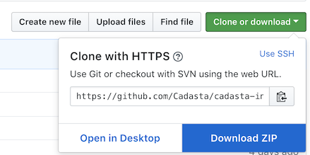
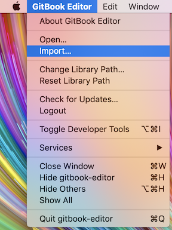
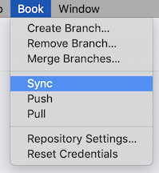
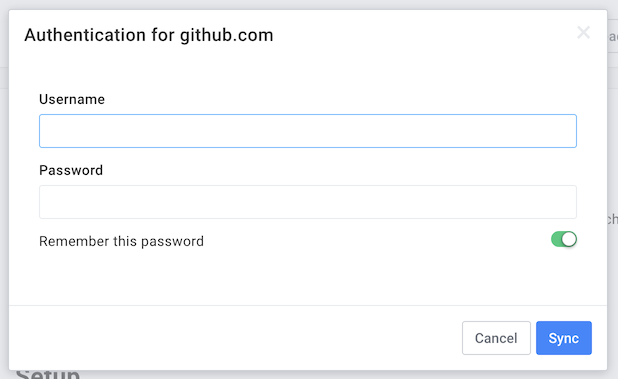

# Getting Started with the GitBook Editor

If you prefer to edit documentation in a WYSIWYG editor, the GitBook Editor may be a good choice.

## Download

The GitBook Editor can be downloaded from its [official website](https://legacy.gitbook.com/editor).

## Setup

Once installed, you will need to import this book's Git repository.

1. Download the GitHub repository to your local machine.

   1. Navigate to the repository URL: [https://github.com/Cadasta/cadasta-internal-docs](https://github.com/Cadasta/cadasta-internal-docs)
   2. Download the repository as a ZIP file.

      

   3. Extract the ZIP file in a temporary folder/directory on your machine \(e.g. your Downloads folder\).

2. Import the repository into GitBook.

   

3. Sync GitBook with GitHub

   1. Instruct GitBook to sync

      

   2. Provide GitHub Username & Password

      

      _Note: If your GitHub account is configured with 2-factor authentication, then you will need to authenticate with GitHub from GitBook with a GitHub personal access token. Read more [here](https://github.com/GitbookIO/feedback/issues/133#issuecomment-243284698)._
